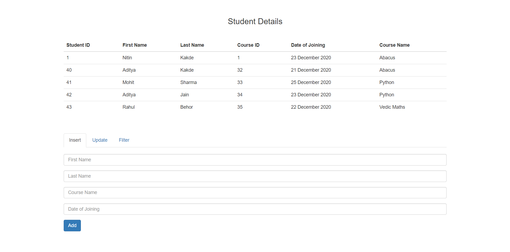
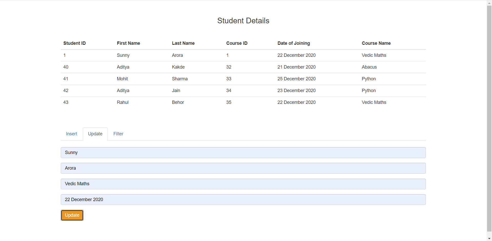
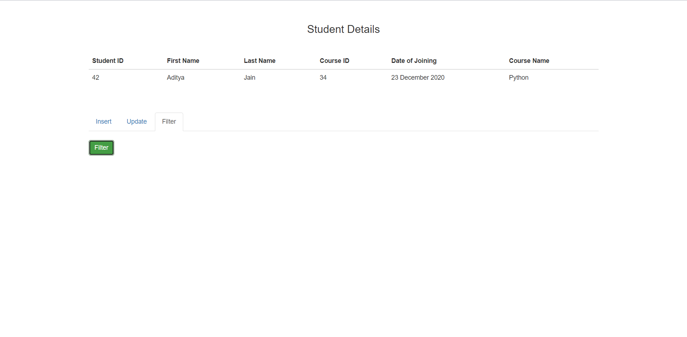
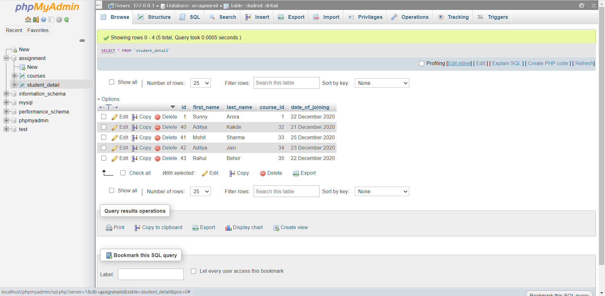
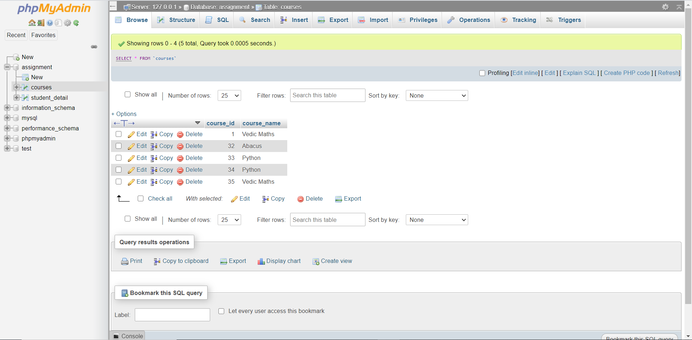

# API Developemt using PHP

Developed an API to update, insert, and filter data from the database using core PHP means without using any framework. This was an assignment for a company.

## Screenshot

## phpMyAdmin Database

